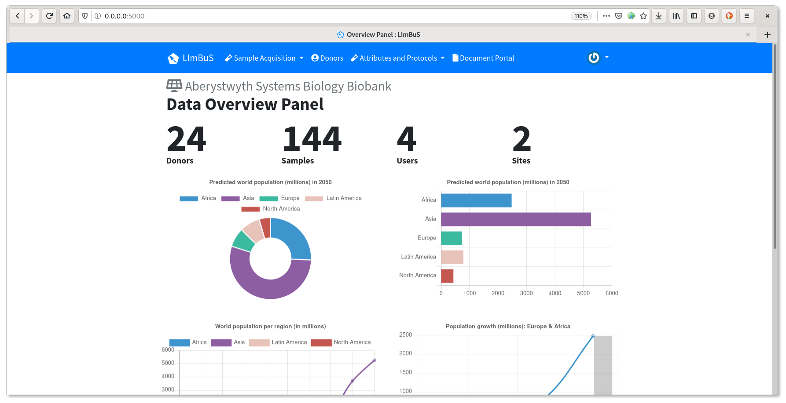

# LImBuS: The LIbre Biobank System

/badge.svg)

The goal of this project is to develop a Biobank Information Management System (BIMS) for the management of biospecimens and associated data that are accepted, processed, distributed, and tracked by the biorepository at Hywel Dda University Health Board's Clinical Research Centre (CRC).

> **Note:** LImBuS is, still very much, in the early stage of development. 

## 🤔 Bug reporting and feature suggestions

Please report all bugs or feature suggestions to the [issues tracker](https://www.github.com/AberystwythSystemsBiology/limbus/issues). Please do not email me directly as I'm struggling to keep track of what needs to be fixed.

We welcome all sorts of contribution, so please be as candid as you want(!)

## 📜 License

This project is proudly licensed under the [GNU General Public License v3.0](https://raw.githubusercontent.com/AberystwythSystemsBiology/limbus/dev/LICENSE).
