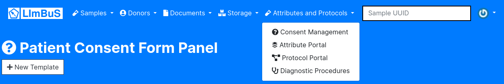
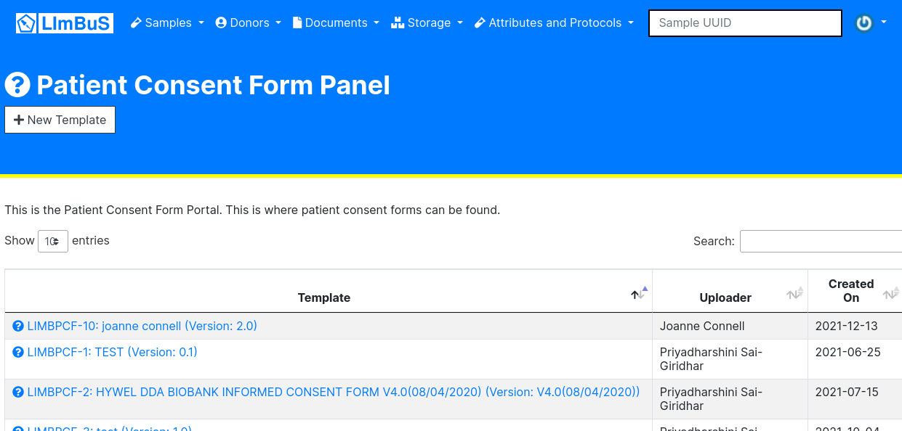

Consent Management
==================

To find the Consent Form Panel click Attributes and Protocols on the Navigation Bar. You should see a drop down:

Click 'Consent Management'. You should now be greeted with the following page:

Adding a Patient Consent Form Template
--------------------------------------