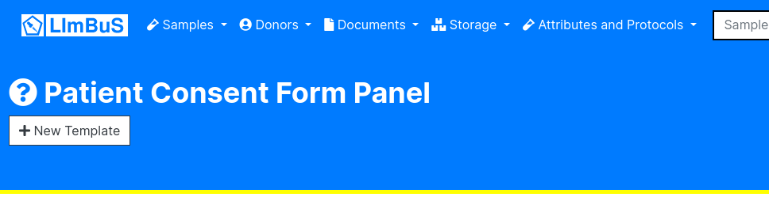
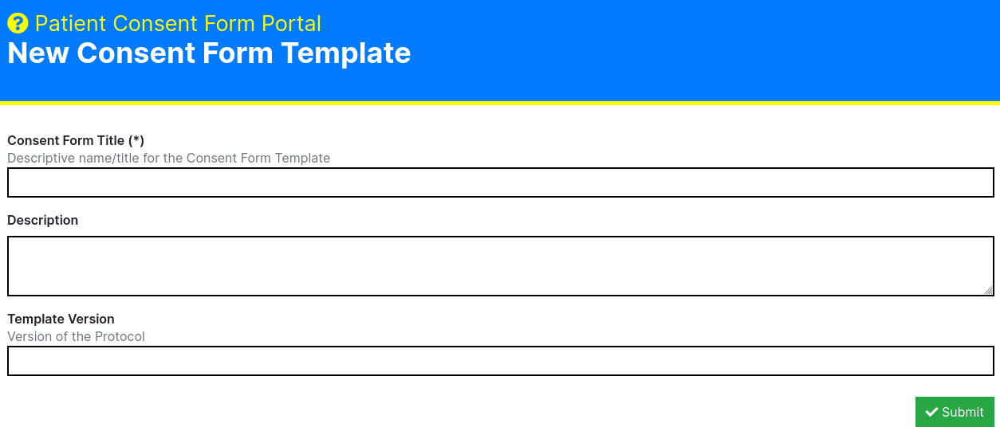
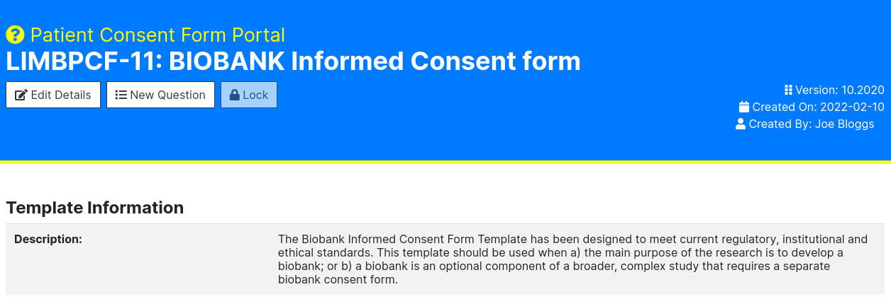

Consent Management
==================

To find the Consent Form Panel click Attributes and Protocols on the Navigation Bar. You should see a drop down:

.. image:: img/attributes_and_prtocols_dropdown.png
  :width: 600
  :alt: The Consent Management button, located under Attributes and Protocols in the Navigation Bar.

Click 'Consent Management'. You should now be greeted with the following page:

.. image:: img/consent/panel.png
  :width: 800
  :alt: Screenshot of the  Patient Consent Form Panel.

Create a new Patient Consent Form Template
------------------------------------------

To create a new Patient Consent Form Template, click on the 'New Template' button found beneath the Patient Consent Form Panel header:

Once you have clicked on the button, you should be greeted with the New Consent Form Template submission form:

Here you can enter the following information:

* **Consent Form Title (Required):** A descriptive name/title for the template. Please ensure that this is identifiable as it'll make indexing and selection far earlier later on. 
* **Description:** A description for the Consent Form Template. This isn't mandatory, but if you have many users from multiple sites, it's highly recommended that you take the time to describe what the consent form is for.
* **Template Version:** If you are uploading a newer or older version of an existing Consent Form Template then you may want to provide a version. This will make it clear what version of a Consent Form Template is where Consent Form Titles are not unique.

Once you have finished entering this information, press the green 'Submit' button on the bottom right of the form.

If successful, you should now be able to see your newly created Consent Form Template in the Consent Form Template Portal

Adding a New Question to a template
-----------------------------------

