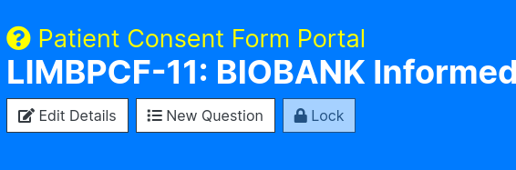
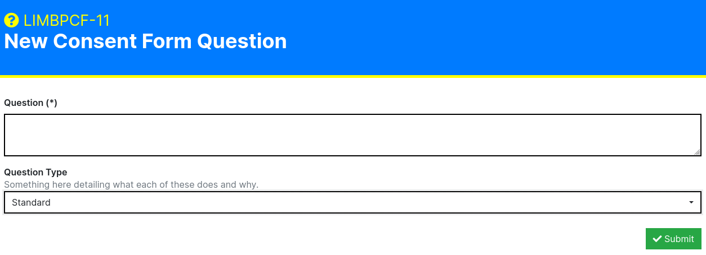

Consent Management
==================

To find the Consent Form Panel click Attributes and Protocols on the Navigation Bar. You should see a drop down:

.. image:: img/attributes_and_prtocols_dropdown.png
  :width: 600
  :alt: The Consent Management button, located under Attributes and Protocols in the Navigation Bar.

Click 'Consent Management'. You should now be greeted with the following page:

.. image:: img/consent/panel.png
  :width: 800
  :alt: Screenshot of the  Patient Consent Form Panel.

Create a new Patient Consent Form Template
------------------------------------------

To create a new Patient Consent Form Template, click on the 'New Template' button found beneath the Patient Consent Form Panel header:

.. image:: img/consent/new_template_button.png
  :width: 600
  :alt: Screenshot of the 'New Template' button, found beneath the Patient Consent Form Panel header

Once you have clicked on the button, you should be greeted with the New Consent Form Template submission form:

.. image:: img/consent/submission_form.png
  :width: 600
  :alt: Screenshot of the 'New Consent Form Template' form.

Here you can enter the following information:

* **Consent Form Title (Required):** A descriptive name/title for the template. Please ensure that this is identifiable as it'll make indexing and selection far earlier later on. 
* **Description:** A description for the Consent Form Template. This isn't mandatory, but if you have many users from multiple sites, it's highly recommended that you take the time to describe what the consent form is for.
* **Template Version:** If you are uploading a newer or older version of an existing Consent Form Template then you may want to provide a version. This will make it clear what version of a Consent Form Template is where Consent Form Titles are not unique.

Once you have finished entering this information, press the green 'Submit' button on the bottom right of the form.

If successful, you should now be able to see your newly created Consent Form Template in the Consent Form Template Portal

.. image:: img/consent/view.png
  :width: 600
  :alt: Screenshot of a new Consent Form Template

Adding a New Question to a template
-----------------------------------

If you would like to make use of granular indexing and filtering based on consent, you can provide digitised versions of questions directly to the Consent Form Template.

To do this, select a Patient Consent Form template that you wish to add questions to. Then click on the 'New Question' button beneath the template heading:

You should now be greeted with the 'New Consent Form Question' form:

Here you will be asked to submit the following:

* **Question (required):** The question on the consent form. This can be in both long and short form, but please ensure that the person involved in entering the data understands what the question is and how it relates to the its actual physical form.
* **Question Type:** One of Standard, Electronic Storage, Genetic Tests, Future Samples, and Available for External Sources

Once you have entered all of the relevant information, click on the green 'Submit' button found at the bottom right of the form to submit the question.

Your new question should now appear in the Questions table.

What are the Question Types?
----------------------------

By default LImBuS offers the following Question Types:

* **Standard:** A generic question.
* **Electronic Storage:** That the donor has consented to their information being electronically stored.
* **Genetic Tests:** That the donor has consented to their samples and information bing used for genetic studies.
* **Future Samples:** That the consent form allows for the future extraction of Samples.
* **Available for External Sources:** That the donor has agreed that the Sample can be shared outside of the biobank.