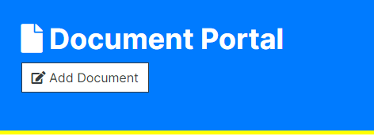
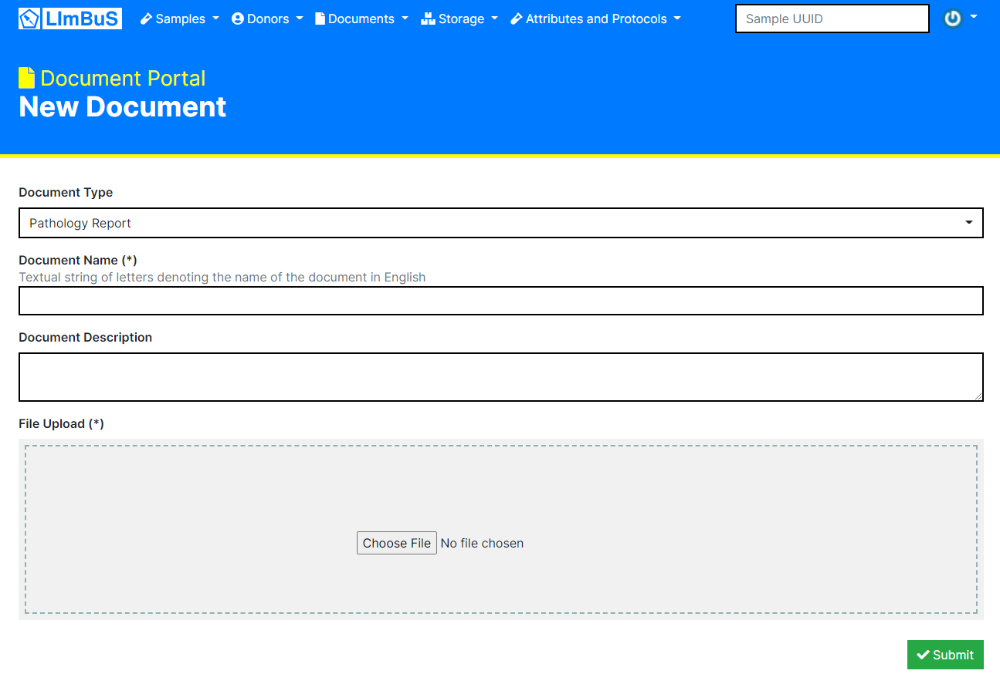
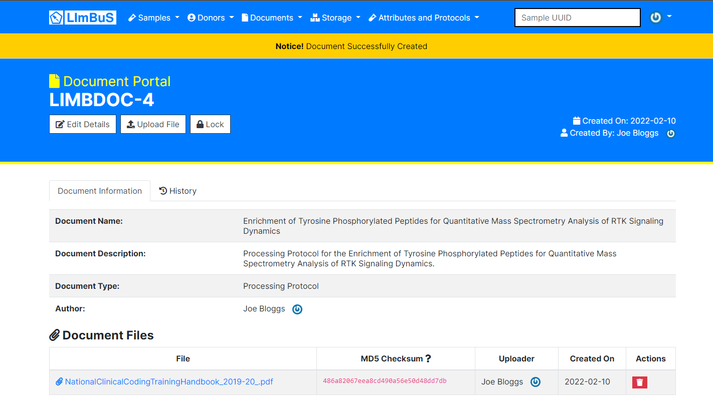

Adding a Document
-----------------

To add a new document, you can either use the 'New Document' button found on the Navigation Bar:

.. image:: img/document_button.PNG
  :width: 600
  :alt: The Document Portal button, located under Document in the Navigation Bar.

Or, alternatively you can use the 'Add Document' button found within the Document Portal header:

You should now be presented with the following form:

The first thing to consider is the Type of Document. Click on the drop down beneath **Document Type** and identify which type of Document is being uploaded. If you are not sure which one to use, click Other or discuss with your friendly system administrator.

As for the **Document Name**, this can be whatever you want it to be. It's usually a good idea to keep this unique as so you can quickly find it in the future.

The **Document Description** is optional. It is strongly recommended that you enter what the purposes of the document is as to ensure that all users know exactly what the document is used for.

Once you've completed those, you can **upload** whichever file you so please. Click on the grey area to pull up a File Explorer, or simply drag and drop a file to it.

Now click the green button at the bottom to submit the form.

Once you have finished, you should be redirected to the newly created Document:

Congratulations, you have successfully added a new Document to LImBuS!