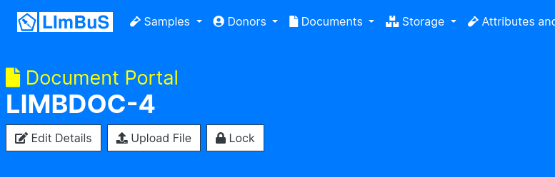
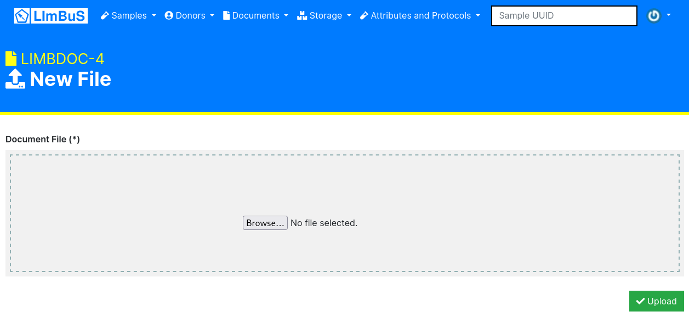

Uploading a new Document
------------------------

If you have an existing Document that you would like to upload a file to, then you can by simply clicking the 'Upload File' button beneath the Document header:

Once you have clicked on the button, you should be greeted with an 'New File' page:

You can either:

1. Drag a file from your computer to the grey box.
2. Click on the grey box and find the file you want to upload through your Operating System's file explorer.

Once you have found the file, click the Green 'Upload' button on the bottom right of the form. If successful, you should now see your new file in the 'Document Files' table.