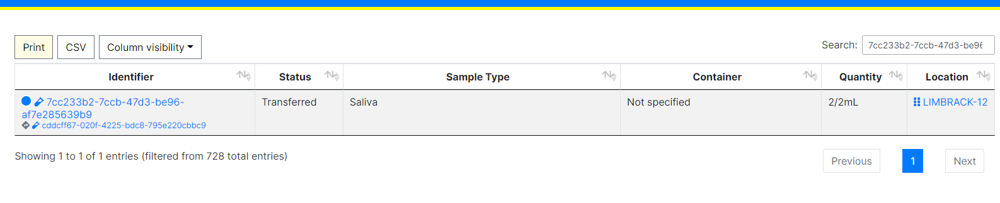

Sample Portal Index
===================

How can I search the Sample Portal?
-----------------------------------

If you would like to do simplistic free text search, you can easily do so by using the Search area on the top right of the Sample Index Portal Table:

How can I filter the Sample Portal?
-----------------------------------

On the left hand side of the Sample Index Portal, you should find the 'Filter' area. Here you can enter information in which to filter the result of the query that gets the Sample information that populates the Sample Index Portal. This includes:

* **Sample Barcode:** If the Sample already has a identifier, then enter it here.
* **Biohazard Level:**  BSL category for the sample.
* **Base Type:** One of Fluid, Cell, or Molecular.
* **Colour:** One of Blue, Red, Green, Yellow, or Grey
* **Sample Source:** One of Available, Destroyed, Unusable, Transferred, Missing, Temporary Storage, Pending Collection, or Pending Review.
* **Site:** Whichever Site the Sample was collected from.
* **Consent Status:** The status of the Sample's consent. One of Active or Withdrawn.
* **Consent For:** Multiple of Standard, Electronic Storage, Genetic Tests, Future Samples and/or Available for External Sources.

Once you have selected which filters you want to use, click on the green 'Apply Filter' button and the table will reload with relevant Samples.
