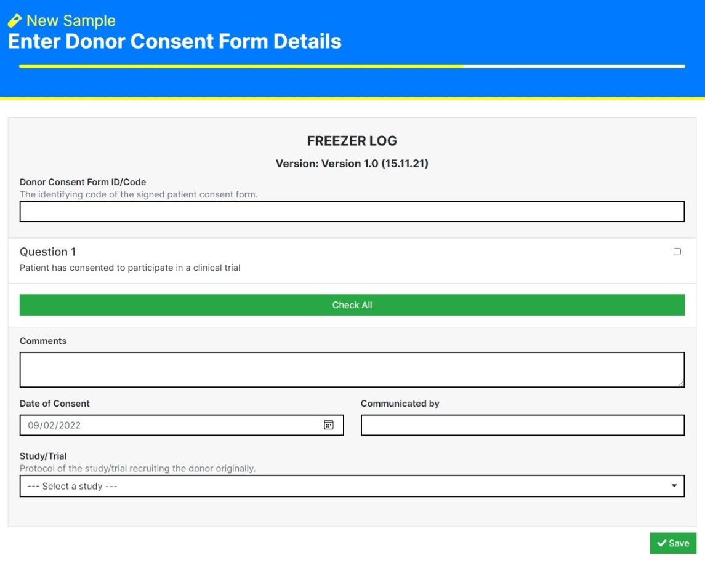
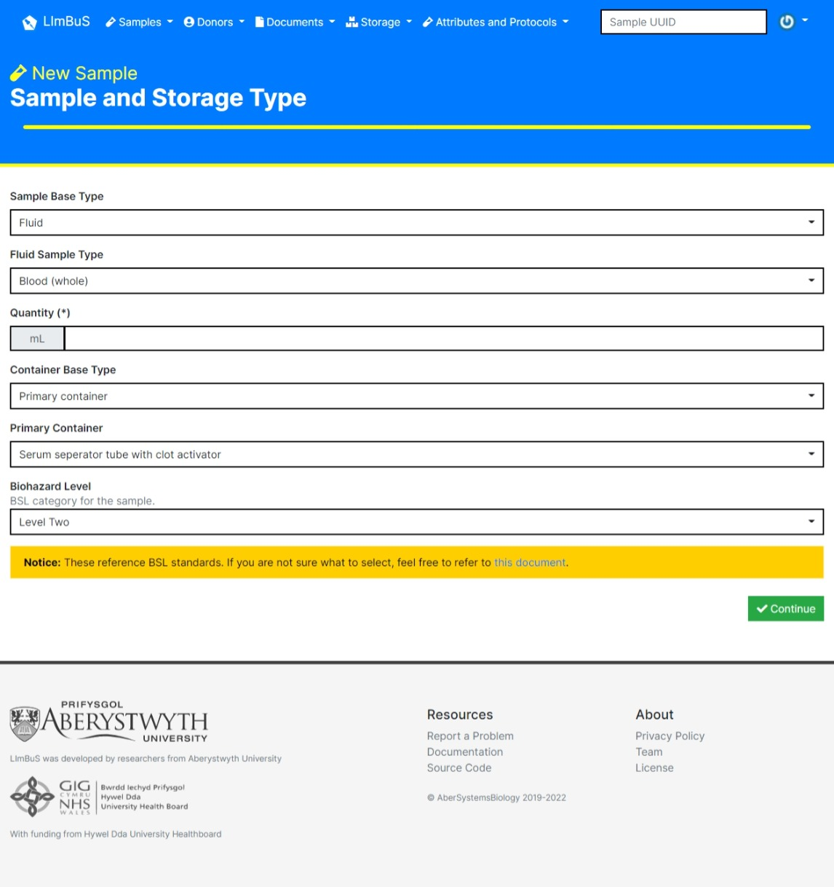
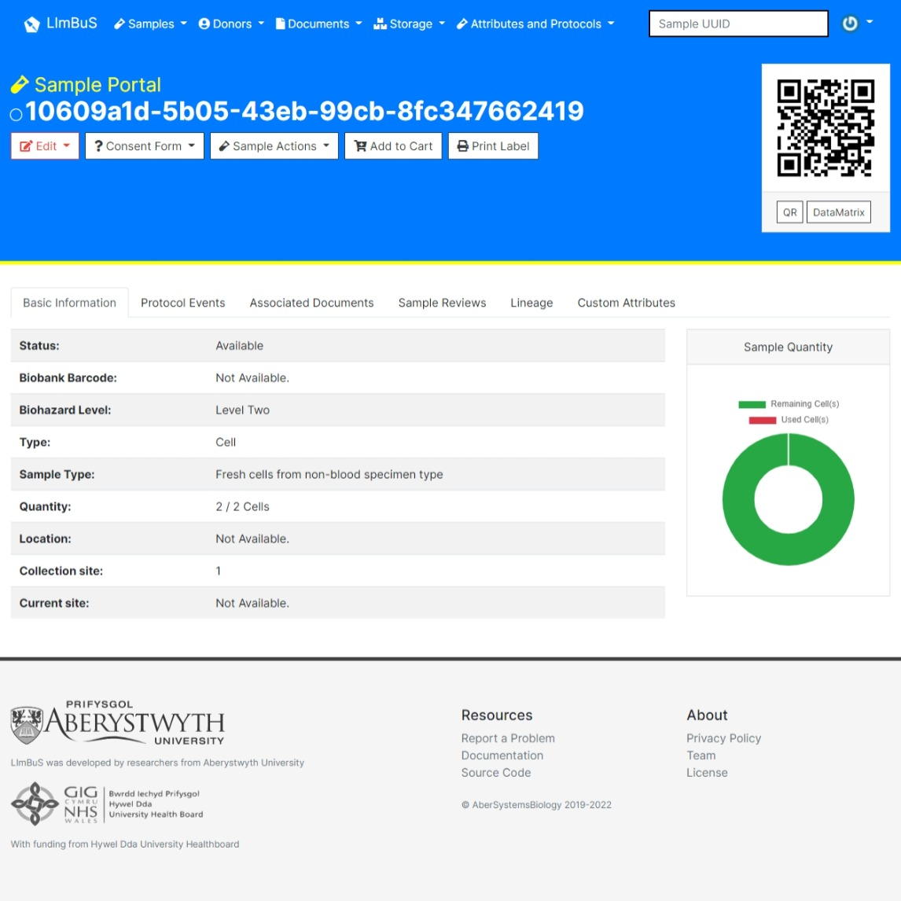

Sample Registration
===================

LImBuS facilitates Samples first collection of biospecimens. In basic English, this means that you can enter a sample without the need of adding Donor information.

Sample Registration Workflow
----------------------------

The below diagram outlines the steps of how LImBuS collects specimens.

.. image:: img/registration/sample_data_entry.png
  :width: 800
  :alt: Standard workflow for the registration of samples.

To start entering a Sample into LImBuS click Samples on the Navigation Bar. You should see a drop down:

.. image:: img/registration/add_button.PNG
  :width: 400
  :alt: The add button, located under Sample in the Navigation Bar.

Click 'New Sample'. 

Step One: Collection and Consent Information
--------------------------------------------

You should now be greeted with the following form:

.. image:: img/registration/step_one.jpeg
  :width: 800
  :alt: Screenshot of theSample Collection and Consent Information form.

.. warning::
    You may see a message asking you to add a Consent Form and/or a Collection Protocol. To do this, follow the Protocol / Consent Form documentation and return to this page.

This page allows you to enter information concerning the collection of the Sample:

* **Sample Status:** The status of the Sample at the time of entry. One of Available, Unusable, Missing, Temporary Storage, Pending Collection, or Pending Review.
* **Sample Biobank Barcode:** If the Sample already has a identifier, then enter it here.
* **Colour:** If you would like to tag the Sample with a colour for easy filtering, then you can here. This defaults to Blue, but can be one of Blue, Red, Green, Yellow, or Grey.
* **Collection Protocol:** The protocol that details how the sample was taken. If you are unable to find the protocol, you have likely not added it. Follow the instructions below the field to add a new Collection Protocol. Refresh the page and your new protocol should be available for selection.
* **Collection Site:** The site in which the sample was taken (either Internal or External sites are available). If you are unable to locate the correct site, please contact your system administrator.
* **Sample Collection Date:** The date in which the sample was collected. This defaults to today.
* **Sample Collection Time:** The time at which the sample was collected. This defaults to now.
* **Collected By (required):** The initials of the individual who collected the sample.
* **Collection Comments:** Any comments pertaining to the collection of the sample.
* **Patient Consent Form Template:** The patient consent form template that reflects the consent form the sample donor signed.
* **Sample Disposal Instruction:** The method of sample disposal. One of No Disposal, Destroy, Transfer, Review, or Preserve. If a user selects anything besides No Disposal, they will be prompted to enter a **Sample Disposal Date**.
* **Sample Disposal Comments:** Any comments pertaining to the future disposal of the sample.

Once you're happy with what you've entered, click the green Continue box at the bottom of the form to continue.

Step Two: Enter Donor Consent Form Details
-------------------------------------------

You should now be greeted with the following form:

This allows you to digitise a Donor Consent Form, and associate the Sample to a Study/Trial.

* **Donor Consent Form ID/Code:** If the consent form already has an identifier, enter it here.
* **Answers:** If the donor has agreed to a question, then tick the right checkbox for each question they've consented to. If they've consented to everything, just click the green "Check All" button.
* **Comments:** Any comments pertaining to the collection of the donor consent form.
* **Date of Consent:** The date in which the donor had provided consent. Defaults to today.
* **Communicated by:** The communicator of the donor consent.
* **Study/Trail:** Protocol of the study/trial recruiting the donor.

Once you're happy with what you've entered, click the green Save box at the bottom of the form to continue.

Step Three: Sample and Storage Type
-----------------------------------

You should now be greeted with the following form:

This allows you to provide Sample Type and Storage information.

* **Sample Base Type:** The base type of the sample. One of Fluid, Cell, and Molecular.
* **Sample Type Information:** This is generated dependent on what Sample Base Type the user has selected.
* **Quantitiy:** The Quantitiy of the Sample being added to the biobank.
* **Container Base Type:** One of Primary Container and Long Term Storage
* **Biohazard Level:** BSL category for the sample. Defaults to Level Two.

Once you're happy with what you've entered, click the green Save box at the bottom of the form to add the Sample to the Biobank.

You should now see that the sample has been added!

