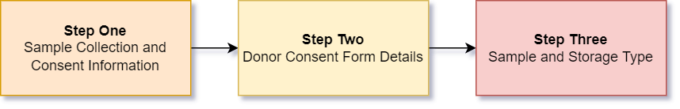
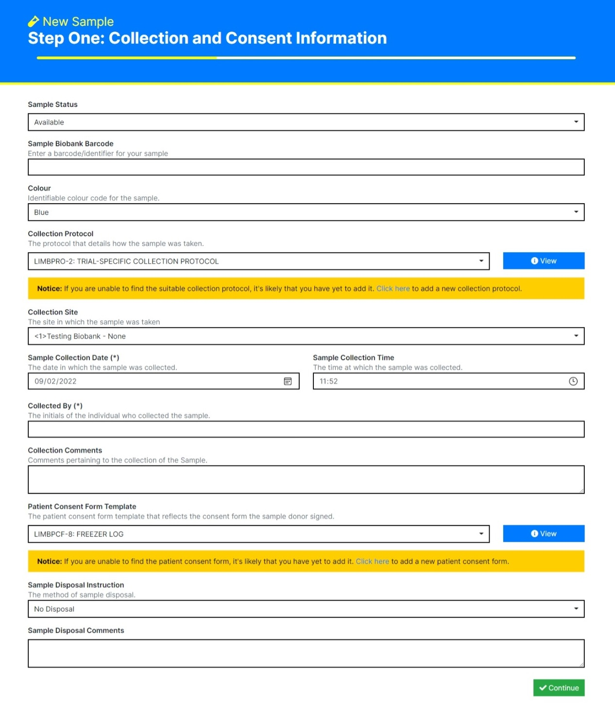

Sample Registration
===================

LImBuS facilitates Samples first collection of biospecimens. In basic English, this means that you can enter a sample without the need of adding Donor information.

Sample Registration Workflow
----------------------------

The below diagram outlines the steps of how LImBuS collects specimens.

Sample Registration
-------------------

On the Navigation Bar, click Samples. You should see a drop down:

.. image:: img/registration/add_button.PNG
  :width: 400
  :alt: The add button, located under Sample in the Navigation Bar.

Click 'New Sample'. You should now be greeted with the following form:

.. warning::
    You may see a message asking you to add a Consent Form and/or a Collection Protocol. To do this, follow the Protocol / Consent Form documentation and return to this page.

This page allows you to enter information concerning the collection of the Sample:

* **Sample Status:**  